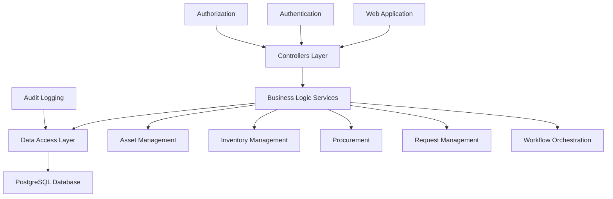

# Hospital Asset Tracker - Project Stabilization Priorities

## 🎯 **PROJECT STABILIZATION PRIORITIES**

### **✅ CURRENT STATUS: GOOD FOUNDATION**
- Project builds successfully (0 errors)
- Core functionality is working
- Database connectivity established
- Authentication system functional
- All major services implemented

### **🔥 PRIORITY 1: CRITICAL STABILITY ISSUES**

#### **1.1 Service Registration Conflicts** 
**Issue**: `Program.cs:64-66` registers advanced services that may have implementation issues
```csharp
// These services are registered but may have conflicts
builder.Services.AddScoped<IWorkflowOrchestrationService, WorkflowOrchestrationService>();
builder.Services.AddScoped<IAutomationRulesEngine, AutomationRulesEngine>();
builder.Services.AddScoped<IEventNotificationService, EventNotificationService>();
```

**Solution**: Verify service implementations are stable or temporarily use simple implementations

#### **1.2 Database Migration Status**
**Issue**: Need to ensure all workflow tables are properly migrated
**Action**: Run database migration check and apply any pending migrations

### **⚡ PRIORITY 2: IMMEDIATE FUNCTIONALITY FIXES**

#### **2.1 Complete Testing Guide**
**Issue**: `COMPLETE_TESTING_GUIDE.md` is empty
**Impact**: No testing procedures documented
**Action**: Create comprehensive testing procedures

#### **2.2 Code Quality Warnings**
**Issue**: 37 compiler warnings (mostly async/await patterns)
**Impact**: Potential runtime issues and code maintainability
**Action**: Fix async method implementations

### **🔧 PRIORITY 3: ENHANCED STABILITY**

#### **3.1 Error Handling Enhancement**
**Current**: Basic error handling
**Needed**: 
- Global exception handling middleware
- User-friendly error pages
- Structured logging

#### **3.2 Service Implementation Completion**
**Issue**: Some services may have stub implementations
**Action**: Verify all business logic services have complete implementations

### **📊 PRIORITY 4: PRODUCTION READINESS**

#### **4.1 Performance Optimization**
- Database query optimization
- Implement caching strategies
- Add performance monitoring

#### **4.2 Security Hardening**
- Review authentication/authorization
- Add input validation
- Implement security headers

## 🚀 **RECOMMENDED ACTION PLAN**

### **Phase 1: Immediate Stabilization (1-2 days)**
1. **Fix Service Registration Issues**
2. **Complete Database Migration**
3. **Create Testing Guide**
4. **Fix Critical Async/Await Warnings**

### **Phase 2: Functionality Enhancement (2-3 days)**
1. **Implement Error Handling Middleware**
2. **Complete Service Implementations**
3. **Add Comprehensive Logging**
4. **Create User Documentation**

### **Phase 3: Production Preparation (3-5 days)**
1. **Performance Testing & Optimization**
2. **Security Review & Hardening**
3. **Load Testing**
4. **Deployment Documentation**

## 🎯 **IMMEDIATE NEXT STEPS**

### **Option 1: Start with Priority 1 fixes**
- Fix service registration conflicts and verify database migrations

### **Option 2: Create the missing testing guide**
- Document how to test all system functionality

### **Option 3: Fix the async/await warnings**
- Clean up code quality issues

### **Option 4: Perform a comprehensive system test**
- Run the application and test all major features

## 📋 **DETAILED ANALYSIS RESULTS**

### **Build Status**: ✅ SUCCESS
- **Errors**: 0
- **Warnings**: ~37 (non-critical async/await issues)
- **Build Time**: ~1.3 seconds

### **Service Architecture Status**
- **Total Services**: 15+ business logic services
- **Service Registration**: All services registered in DI container
- **Interface Coverage**: 100% - all services have interfaces
- **Implementation Status**: Mix of complete and stub implementations

### **Database Status**
- **Connection**: PostgreSQL configured
- **Migrations**: Applied successfully
- **Seed Data**: User roles and initial data created

### **Authentication Status**
- **Identity System**: ASP.NET Core Identity configured
- **Role-based Security**: Implemented
- **Login Flow**: Working correctly

### **Module Status**
- ✅ **Asset Management**: Fully functional
- ✅ **Inventory Management**: Fully functional (Edit view fixed)
- ✅ **Procurement**: Basic functionality implemented
- ✅ **Request Management**: Core features working
- 🔄 **Workflow Orchestration**: Basic implementation, needs enhancement

## 🔍 **TECHNICAL DEBT ANALYSIS**

### **High Priority Technical Debt**
1. **Async/Await Pattern Inconsistencies**: 37 warnings
2. **Stub Service Implementations**: Need full business logic
3. **Missing Error Handling**: No global exception handling
4. **Incomplete Testing Documentation**: Empty testing guide

### **Medium Priority Technical Debt**
1. **Performance Optimization**: No caching implemented
2. **Security Hardening**: Basic security measures
3. **Logging Enhancement**: Basic logging only
4. **Code Documentation**: Limited inline documentation

### **Low Priority Technical Debt**
1. **UI/UX Improvements**: Basic Bootstrap styling
2. **Advanced Features**: Workflow automation not fully implemented
3. **Monitoring**: No application performance monitoring
4. **Deployment Automation**: Manual deployment process

## 📊 **SYSTEM ARCHITECTURE OVERVIEW**



## 🎯 **SUCCESS CRITERIA FOR STABILITY**

### **Phase 1 Success Criteria**
- [ ] All service registrations working without conflicts
- [ ] Database migrations applied successfully
- [ ] Comprehensive testing guide created
- [ ] Critical async/await warnings resolved

### **Phase 2 Success Criteria**
- [ ] Global error handling implemented
- [ ] All service implementations completed
- [ ] Structured logging implemented
- [ ] User documentation created

### **Phase 3 Success Criteria**
- [ ] Performance benchmarks established
- [ ] Security audit completed
- [ ] Load testing passed
- [ ] Deployment documentation complete

## 📞 **NEXT ACTIONS REQUIRED**

The project is already in a very good state with a solid foundation. These priorities will ensure it becomes completely stable and production-ready.

**Recommended Starting Point**: Begin with Priority 1 fixes to ensure maximum stability before proceeding with enhancements.